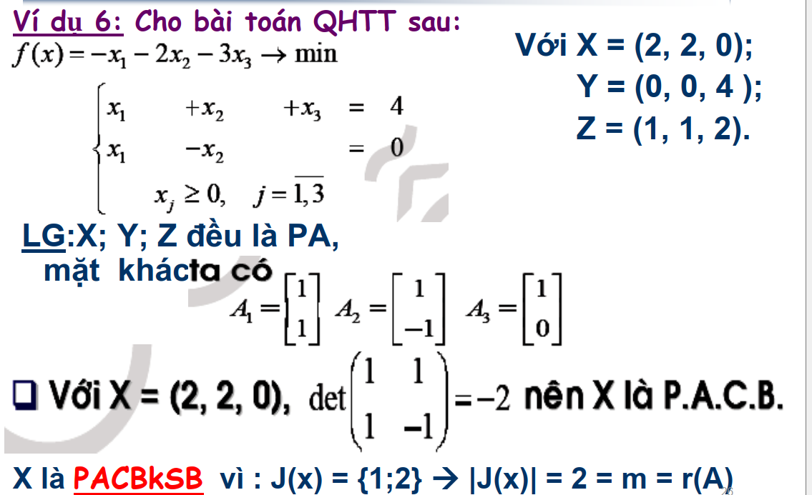
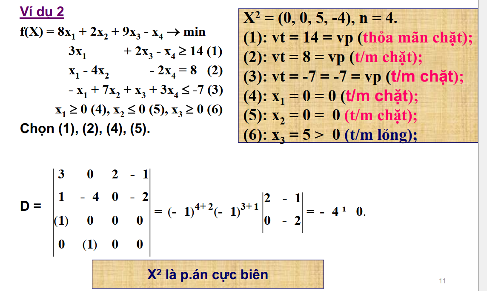
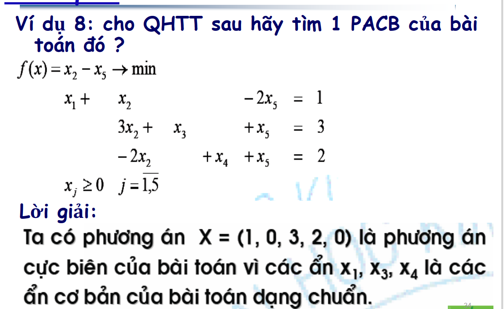

# Chứng minh có phải là một phương án hay không ?
Thế $X_0$ vào các ràng buộc, nếu thỏa hết thì là phương án.
# Chứng minh có phải là một phương án cực biên. ?
## Bài toán dạng chính tắc
Hệ vector $A_j$  (hệ số của ràng buộc chung) tương ứng đối với thành phần của phương án có định thức $\neq$ 0.

Như ở trên là ta thấy được ở X có giá trị 0 tương ứng với $x_3$ nên chỉ lấy ma trận hệ số của $x_{2}, x_3$

## Bài toán dạng ban đầu
1. Chứng minh đó là một phương án 
2. Chứng minh rằng phải có đủ ít nhất n ràng buộc [Thỏa mãn chặt](Các%20khái%20niệm%20cơ%20bản%201#Thỏa%20mãn%20chặt%20và%20lỏng) với n là số biến có trong bài toán. ==Lưu ý ở đây các ràng buộc về dấu cũng tính==
4. Dựa vào các thỏa mãn chặt đó chứng minh các ràng buộc chặt trên có định thức  $!=$ 0    
1f731.png)### Không suy biến và suy biến
Suy biến: tức biến cơ sở = 0
==Lưu ý: Chứng minh khi bài toán đang ở dạng chính tắc==

Định thức của $\det(J(x)) = m = r(A)$ thì không suy biến
Định thức của $\det(J(x)) = m < r(A)$ thì  suy biến
Trong đó:
1. $J(x)$: là ma trận hệ số của biến cơ sở
2. $m$: là số lượng ràng buộc chung
3. $A$: là ma trận hệ số của ràng buộc chung
# Tìm một phương án cực biên
1. Tìm một phương án bằng cách chọn ra các biến cơ sở rồi lập hệ phương trình bằng cách chọn ra m cột (m là số ràng buộc chung)
2. Tính định thức hệ số tương ứng với các biến có trong cơ sở $\neq 0$ 
Đối với bài toán dạng chuẩn thì PACB tương ứng với các biến tạo thành ma trậ04763b6a9e038f3008077d702f.png)