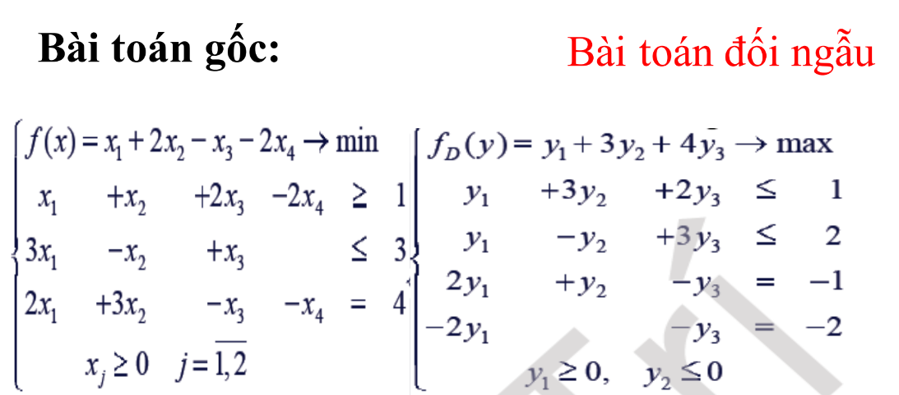
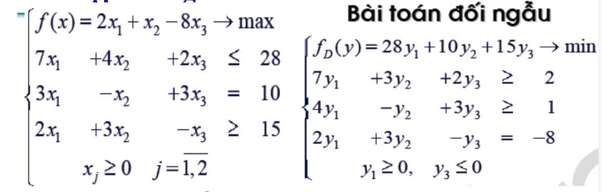
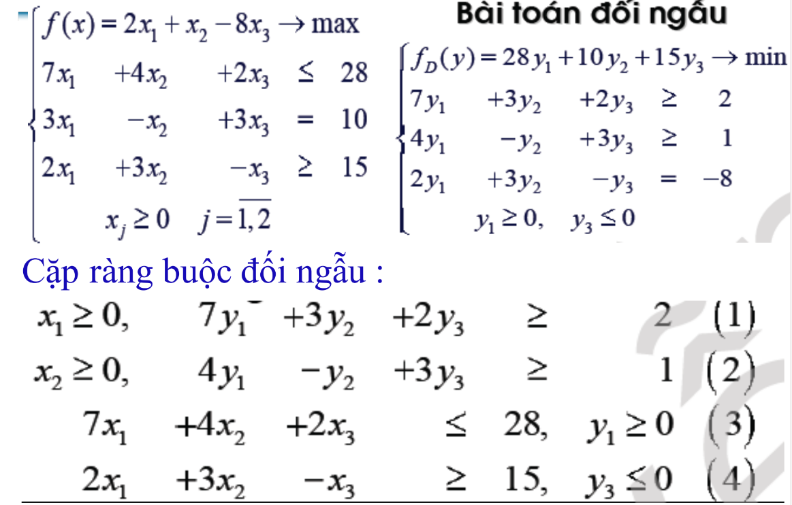
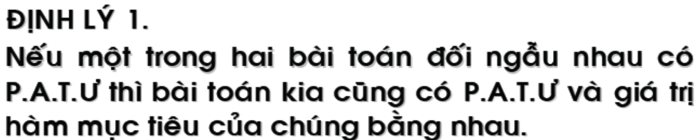
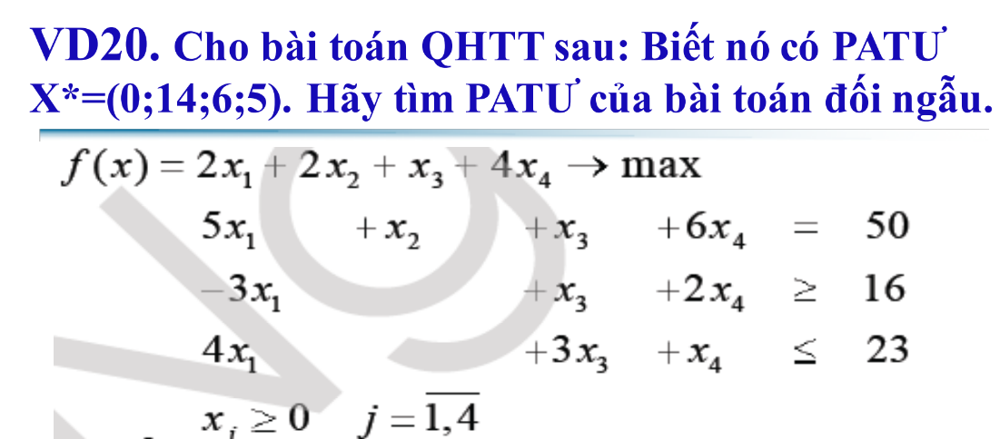
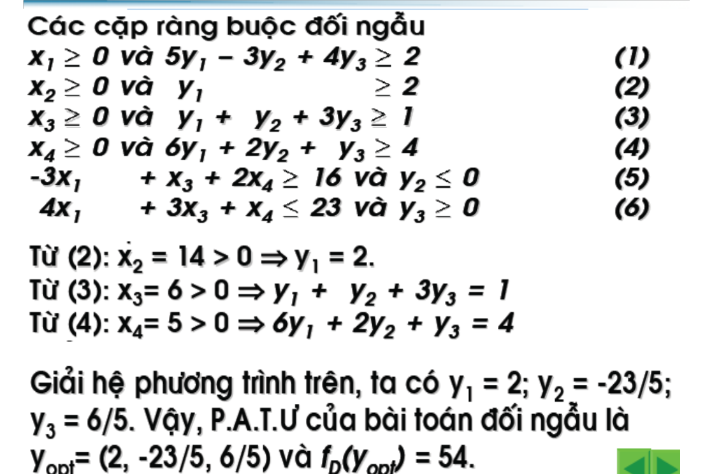
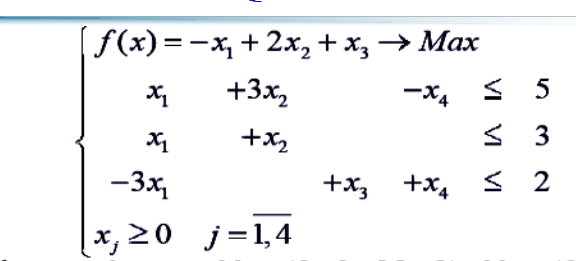
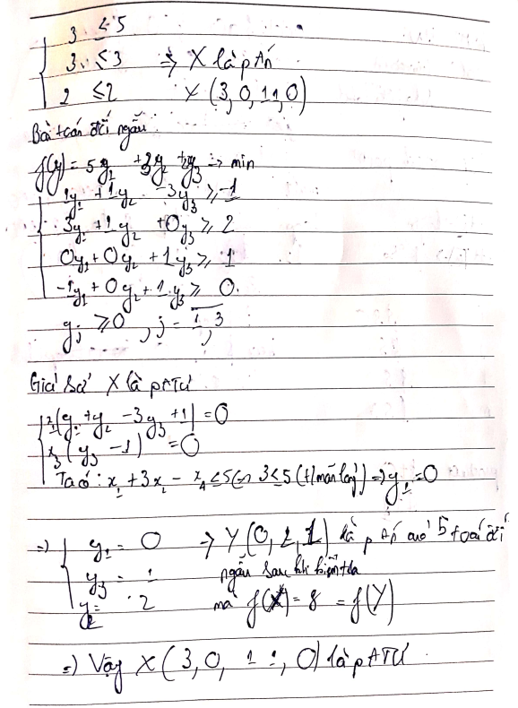

# Quy tắc đổi dấu

==Lưu ý: ==
1. Ràng buộc về dấu ở bài toán đối ngẫu luôn là số 0
2. Khi đề bài cho $x_{i} \ge 0$ phải coi i là những số nào
3. Nhớ đừng xem có bao nhiêu biến ở hàm mục tiêu mà xem bao nhiêu biến trong các ràng buộc chung ở bài toán gốc
# Cặp đối ngẫu
a8d0a.png)
Cặp đối ngẫu thì phải liệt kê ra hết kể cả đó là ẩn tùy ý
# Định lý trong bài toán f23b0b4c89fe4df.png)
==Giá trị hàm mục tiêu của hai bài toán bằng nhau==
# Dựa vào patư của bài toán ban đầu để tìm patư của bài toán gốc.

Sử dụng độ lệch bù yếu
$x_{j}.\left(\sum a_{ij}. y_i - b_j\right) = 0$
$y_{j}.\left(\sum a_{ij}. x_1gs/0d2e247c7c35e3c7abe6be50b356f6b2.png)
==Lưu ý: ==
1. Tìm được hệ phương trình giải bằng cách tìm cặp đối ngẫu  tương ứng với giá trị trong patu ban đầu > 0
	Như ở trên thì ta có được 14, 6, 5 tương ứng với $x_{2}, x_{3}, x_4$
## Thiếu phương trình
Đôi lúc sẽ thiếu 1 phương trình, ta cần xem xét [Ràng buộc lỏng](Các%20khái%20niệm%20cơ%20bản%201#Thỏa%20mãn%20chặt%20và%20lỏng) ở các ràng buộc ở bài toán ban đầu để xác định được cặ có đúng không nếu đúng thì đó là phương án tối ưu
 0, 11, 0) là PATU
