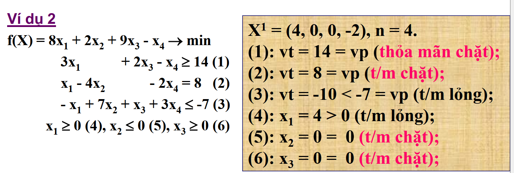
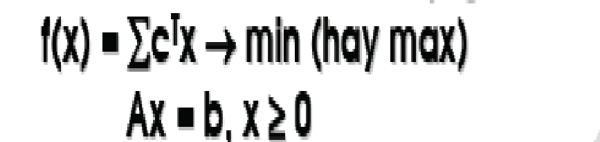

# Hàm mục tiêu, ràng buộc chung, ràng buộc về dấu
1. f(x): hàm mục tiêu
2. (>= || <=) 0: ràng buộc về dấu
3. còn lại: ràng buộc chung
# Thỏa mãn chặt và lỏng 
Thế $X_0$ vào một ràng buộc thì xuất hiện dấu =

# Các dạng bài toán quy hoạch tuyến tính
## Bài toán dạng chính tắc

## Bài toán dạng chuẩn
Tương tự như bài toán chuẩn tắc tuy nhiên sẽ chưa ma trận con là ma trận đơn vị
