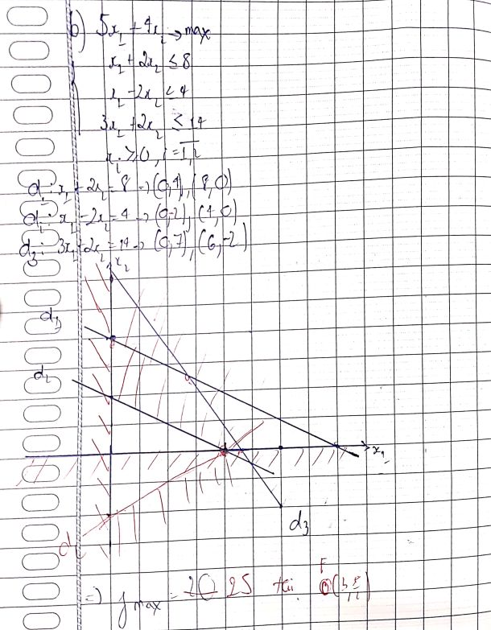

==Lưu ý:==
Trong quá trình biến đổi nếu có tạo ra  thêm một cột trong ma trận đơn vị thì vẫn được
Khi có thêm các biến thì phải kết luận cho bài toán gốc và bài toán mới
# Dạng 1: Bài toán có dạng ma trận đơn vị
==Đừng tham khảo bài ở dưới chưa viết xong==
## $B_{1}$: Chuyển về dạng chuẩn chính tắc
$\begin{align*}&x_1 + ... &= b_1(1) \\&x_2 + ...&= b_2 & (2) \\&x_{3 +}... &= b_3 & (3) \end{align*}$
$\Rightarrow$ PACB ban đầu là $x = (b_{1}, b_{2}, b_{3}, 0, ..., 0)$
Các hệ số không phải là nằm trong ma trận đơn vị đều bằng 0.
## $B_2$: Tìm PACB liền kề
$\begin{align*}&x_1 + 2x_4 + 4x_5 + 6x_6 &= 4(1) \\&x_2 + x_4 + 2x_{5} + 3x_6&= 3 & (2) \\&x_3 - x_{4} + 2x_{5} + x_6 &= 1 & (3) \end{align*}$

| $A_1$ | $A_2$ | $A_3$ | $A_4$ | $A_5$ | $A_6$ | $b$          |
| ----- | ----- | ----- | ----- | ----- | ----- | ------------ |
| 1     | 0     | 0     | 2     | 4     | 6     | 4 ==x 1/2==  |
| 0     | 1     | 0     | 1     | 2     | 3     | 3 ==x -1/2== |
| 0     | 0     | 1     | -1    | 2     | 1     | 1 ==x 1/2==  |
Chọn $A_4$ vào 
**Lưu ý:**
1. Hệ số âm không cần quan tâm đến
2. Chọn tỉ số bé
Ta có: $b/A_4$ = {2, 3}
$\Rightarrow$ $A_1$ ra
Tạo được bảng mới

| $A_1$ | $A_2$ | $A_3$ | $A_4$ | $A_5$ | $A_6$ | $b$ |
| ----- | ----- | ----- | ----- | ----- | ----- | --- |
| 1/2   | 0     | 0     | 1     | 2     | 3     | 2   |
| -1/2  | 1     | 0     | 0     | 0     | 0     | 1   |
| 1/2   | 0     | 1     | 0     | 4     | 4     | 3   |

Tìm được Pacb mới x = {0, 1, 3, 2, 0, 0}
## $B_3$: Tìm Pacb mới tốt hơn.
$\begin{align*}f(X) &= 3x_1 + x_2 + 3x_3  \to \max\\&2x_1 + x_2 + x_3 &\le 2 & (1) \\&x_1 + 2x_2 + 3x_3 &\le 5 & (2) \\&2x_1 + 2x_{2} + x_{3} &\le 6 & (3) \\&x_1 &\ge 0, & (4) \\&x_2 &\le 0, & (5) \\&x_3 &\ge 0. & (6)\end{align*}$

$\Rightarrow\begin{align*}f(X) &= -(3x_1 + x_2 + 3x_3)  \to \min\\&2x_1 + x_2 + x_{3} + x_4&= 2 & (1) \\&x_1 + 2x_2 + 3x_{3}+ x_5 &= 5 & (2) \\&2x_1 + 2x_{2} + x_{3} + x_{6}&= 6 & (3)\\ &x_{j} &\ge 0, j &= 1...6 \end{align*}$
$C = (-3, -1, -3, 0, 0, 0)$

**Lưu ý:**
1. $C_B$ đọc từ trên đọc xuống.
$C_{B} = (C_{4}, C_{5}, C_{6)}= (0, 0, 0)$
2. Các hệ số của f(x) =$\displaystyle \sum_{i=1}^{n}C_{b} A_{i} - C$ 

|        | -3    | -1    | -3    | 0     | 0     | 0     | c                    |
| ------ | ----- | ----- | ----- | ----- | ----- | ----- | -------------------- |
| $C_B$  | $A_1$ | $A_2$ | $A_3$ | $A_4$ | $A_5$ | $A_6$ | $b$                  |
| 0      | 2     | 1     | 1     | 1     | 0     | 0     | 2 ==x 1/2==          |
| 0      | 1     | 2     | 3     | 0     | 1     | 0     | 5 ==x -1/2==         |
| 0      | 2     | 2     | 1     | 0     | 0     | 1     | 6 ==x -1==           |
| $f(x)$ | ==3==   | 3     | 0     | 0     | 0     | 0 = $f_0$ ==x -3/2== |
3. Lấy cột có phần tử hệ số dương nhất ở đây là $A_{1}$ vào
Chọn $A_1$ vào $\Rightarrow$ $A_4$ ra

| $A_1$ | $A_2$ | $A_3$                   | $A_4$ | $A_5$ | $A_6$ | $b$ |
| ----- | ----- | ----------------------- | ----- | ----- | ----- | --- |
| 1     | 1/2   | 1/2                     | 1/2   | 0     | 0     | 1   |
| 0     | 3/2   | 5/2                     | -1/2  | 1     | 0     | 4   |
| 0     | 1     | 0                       | -1    | 0     | 0     | 4   |
| 0     | -1/2  | ==3/2 > 0 chưa tối ưu== | -3/2  | 0     | 0     | -3  |
$\Rightarrow$ Phải làm tiếp

| $A_1$ | $A_2$ | $A_3$                   | $A_4$ | $A_5$ | $A_6$ | $b$ |
| ----- | ----- | ----------------------- | ----- | ----- | ----- | --- |
| 1     | 1/2   | 1/2                     | 1/2   | 0     | 0     | 1   |
| 0     | 3/2   | 5/2                     | -1/2  | 1     | 0     | 4   |
| 0     | 1     | 0                       | -1    | 0     | 0     | 4   |
| 0     | -1/2  | ==3/2 > 0 chưa tối ưu== | -3/2  | 0     | 0     | -3  |
# Dạng 2: Bài toán M
Đối với bài toán M khi các biến cơ sở đã đi ra là các biến đặt ẩn giả M thì khỏi phải tính nữa
Khi trình bày bài toán M phải trình bày phương án cực biên xuất phát
# Dạng 3: Bài toán chỉ chứa hai ẩn để giải 
$f(x) = C_{1}x_{1} + C_{2}x_{2} -> max(min)$
1. Vẽ hình theo các ràng buộc thành các đường thẳng bao gồm cả ràng buộc về dấu
2. Xác định miền hợp lệ
3. Xác định patu thông qua việc thử và sai các điểm  còn trong miền hợp lệ và do các đường thẳng từ các ràng buộc giao nhau hoặc xác định $\vecto(OC)$ với C có tọa độ $C_{1}, C_{2}$

